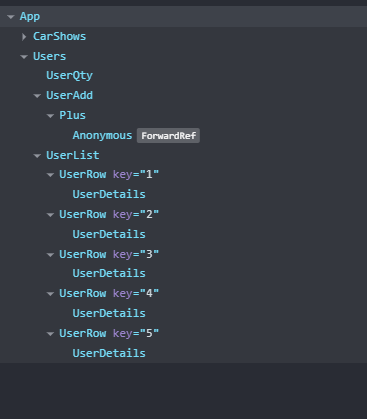

# React + Vite with TailwindCSS

https://react-app-with-tapascript.netlify.app/

# Task 3: 🚗


A web-based application showcasing premium cars, featuring a **Mercedes Luxury Sedan (2023 model)** with interactive details, responsive design, and filtering options.  

## 📝 Project Overview  
This project highlights high-end vehicles, focusing on their **brand, year, price, and premium status**. It provides users with a seamless browsing experience and allows them to explore car details effectively.  

---

## 📌 Features  
✅ **Luxury Car Showcase** – Display premium vehicles with detailed specifications.  
✅ **Responsive Design** – Supports different screen sizes (Desktop, Tablet, Mobile).  
✅ **Filtering & Sorting** – Users can filter cars based on brand, price, and year.  
✅ **Interactive UI** – Built using **React.js & Tailwind CSS** for a modern look.  
✅ **Future Enhancements** – Adding car comparisons, finance calculators, and test drive booking.  

---

## 🏎 Car Details  
- **Type**: Luxury Sedan  
- **Brand**: Mercedes  
- **Year**: 2023  
- **Price**: $80,000  
- **Premium**: Yes  

---

## 📂 Tech Stack  
- **Frontend**: React.js, Tailwind CSS  
- **Backend**: Node.js / Express (if needed)  
- **Database**: Firebase / MongoDB (optional)  
- **API Integration**: Fetching real-time car market data  

---

## 🖥️ Responsive Layout  
Implemented using Tailwind CSS: 

## 📌 How to Run the Project  

Follow these steps to set up and run the project locally:

### **Step 1: Clone the Repository**  
    git clone https://github.com/TechMainul-dev/react-with-tapas-bhai.git
    
### **Step 2: Install Dependencies then run with this commands**

    npm install or  yarn install
    npm run dev
open link "http://localhost:5173/"


# Task 4: 🚗 React Car App with search and filter

This project is a React application that allows users to filter and display cars based on their premium status. The app demonstrates the use of state management, conditional rendering, and array manipulation in React.

---

## 📋 Requirements

1. **Diagram (PNG)**: A visual representation of the component structure and state flow.
2. **State Name and Component Location**: 
    i. Search → BookList,
    ii. Featured (isPremium) → CarShows
3. **Project Link**: A link to the live project or repository.

---

## 📂 Project Structure

### Diagram
  
*(Replace `diagram.png` with the actual file name of your diagram.)*

---

### State and Component Details

| **State Name**      | **Component Location**       | **Description**                                                                 |
|----------------------|------------------------------|---------------------------------------------------------------------------------|
| `search`              | `App.js`                     | Holds the list of cars. Updated based on the premium filter.                    |
| `toggleFeatured`    | `App.js`                     | Function to filter cars based on the `isPremium` property.                      |

---

## 🚀 How to Run the Project

1. Clone the repository:
   ```bash
   git clone <repository-link>
Navigate to the project directory:

bash
Copy
cd <project-folder>
Install dependencies:

bash
Copy
npm install
Start the development server:

bash
Copy
npm start
Open your browser and visit http://localhost:3000.

🔗 Project Link
GitHub Repository: https://github.com/TechMainul-dev/react-with-tapas-bhai.git

Live Demo: https://react-app-with-tapascript.netlify.app/


# Task 5: 👥
🚀 Features
Display a list of users with their full name, age, and occupation.

Add a random user to the list by clicking the + icon.

Show the total user count at the top of the page.

Built with Vite for fast development and TailwindCSS for styling.

Includes a Figma UI design, component breakdown diagram, and component hierarchy diagram.

Deployed publicly for easy access.

### Project Structure
  


### Component Hierarchy Diagram :

  

